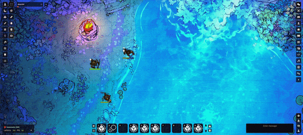

# foundry-sports

A FoundryVTT module that adds a roll success animation that is totally similar to no game in particular.

Requires [Dice So Nice](https://foundryvtt.com/packages/dice-so-nice/).

### How it works

This module hooks into Dice So Nice and adds a custom effect. Somehow, I cannot find any other open source project that does that?

As a result, because I need to subclass objects defined in that module, I had to remove the build system I originally set in place. Maybe this could be done by externalizing Dice So Nice as a library in the Vite config, but hey this is just a fun little experiment.

### Credits

Easing functions from https://easings.net/
Additional support code from three.js - Copyright © 2010-2026 three.js authors
